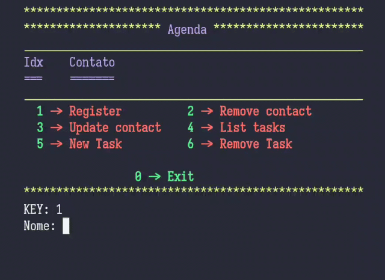

# Agenda CLI


## Proposta

Agenda CLI é um programa de linha de comando que simula uma agenda, onde é possível 
cadastrar contatos, e atribuir ao mesmo lembretes de tarefas corriqueiras.

## Instalação

### Observação 
Este programa foi escrito para ser usado em um ambiente Linux, no entanto seu código fonte
se encontra na pasta *src* para outros formatos de compilação.


### Instalação Linux

Ao adentrar a pasta do projeto dígite:

``` bash
    # 1° passo: (Para criar uma solução)
    make
    # 2° passo: (Executar o programa criado)
    make run
```

Após Esta etapa o programa inicia sua execução, basta interagir com as opções do menu. 



